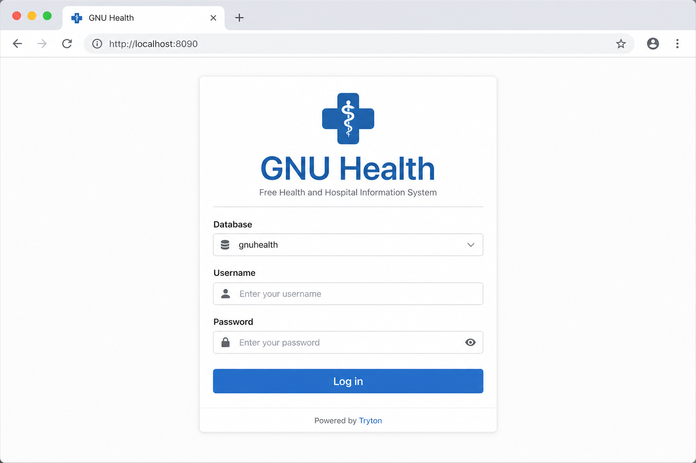
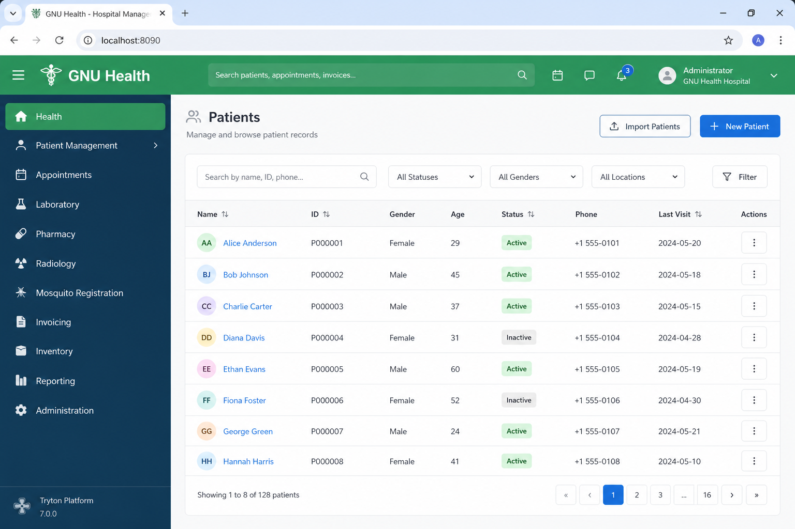
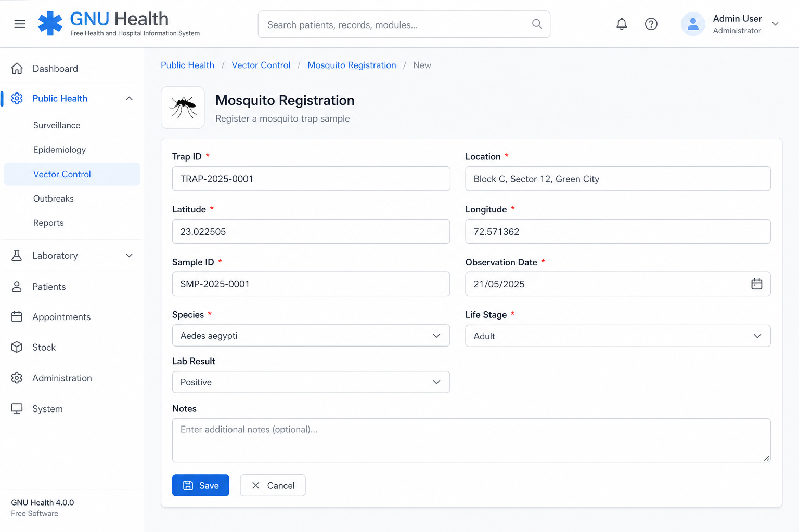
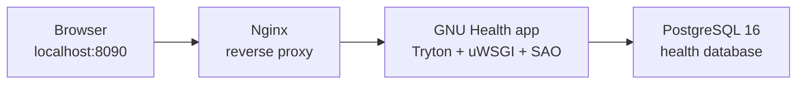

# GNU Health — Local Docker Development

[](LICENSE)

Run **[GNU Health 5.x](https://www.gnuhealth.org/)** locally with Docker. This repository packages a full hospital information system stack — PostgreSQL, the GNU Health application server, and an Nginx reverse proxy — so you can develop, test, and extend GNU Health without manual installation.

Maintained by [sat-found](https://github.com/sat-found/).

---

## What is GNU Health?

[GNU Health](https://www.gnuhealth.org/) is a free/libre Hospital Information System (HIS) and Electronic Medical Record (EMR) built on the [Tryton](https://www.tryton.org/) framework. It covers:

- **Patient management** — demographics, encounters, appointments
- **Clinical records** — evaluations, prescriptions, immunizations
- **Laboratory** — orders, results, sample tracking
- **Financial** — billing, insurance, accounting
- **Public health** — disease surveillance, epidemiology

This project adds a **Mosquito Registration** module for vector surveillance (trap data, species identification, lab results) — useful for public health and epidemiology research.

---

## Screenshots

### Login

Open the web UI at **http://localhost:8090** and sign in with the credentials below.



| Field    | Value          |
|----------|----------------|
| Database | `health`       |
| Username | `admin`        |
| Password | `gnusolidario` |

### Main interface

After login you get the full GNU Health menu — patient records, laboratory, scheduling, and more.



### Mosquito Registration module

A custom module included in this build for tracking mosquito trap samples, species, and lab results.



---

## Quick start

### Prerequisites

| Requirement | Details |
|-------------|---------|
| Docker Desktop | Installed and running |
| RAM | 8 GB+ allocated to Docker |
| Disk space | ~5 GB for images and volumes |

Verify Docker is available:

```bash
docker info
```

### 1. Clone the repository

```bash
git clone https://github.com/sat-found/gnu-heath.git
cd gnu-heath
```

### 2. Configure environment

Copy the environment template and adjust if needed:

```bash
cp gnuhealth/env.template .env
```

Default values work out of the box for local development.

### 3. Start the stack

```bash
./scripts/start.sh
```

The first run **builds Docker images and initializes databases**. This typically takes **20–40 minutes**. Subsequent starts are much faster.

### 4. Open the web UI

**http://localhost:8090**

Log in with database `health`, user `admin`, password `gnusolidario`.

### 5. Stop when done

```bash
./scripts/stop.sh
```

Data is preserved in Docker volumes across restarts.

---

## Architecture

```
Browser  →  Nginx (:8090)  →  GNU Health app (:8000)  →  PostgreSQL (:5432)
```



| Container | Image / build | Role |
|-----------|---------------|------|
| `db` | `postgres:16.2` | Database server |
| `app` | `./gnuhealth` (custom build) | GNU Health server + web client |
| `web` | `nginx:1.25.4` | Reverse proxy for the SAO web UI |

Persistent data is stored in Docker volumes:

- `db-data` — PostgreSQL data files
- `app-data` — GNU Health attachments and file store

---

## Project layout

```
gnu-heath/
├── docker-compose.yml       # Main stack definition (db + app + nginx)
├── .env                     # Local environment (not committed — copy from template)
├── gnuhealth/               # Application Docker image
│   ├── Dockerfile           # Builds GNU Health 5.x via gnuhealth-all-modules
│   ├── env.template         # Environment variable reference
│   ├── init_and_run.sh      # Container entrypoint — DB init + server start
│   ├── trytond.ini          # Tryton server configuration
│   └── mosquito_registration/  # Custom vector surveillance module
├── web-site/
│   └── reverse_proxy.conf   # Nginx proxy config (CORS-safe for local dev)
├── scripts/
│   ├── start.sh             # Build and start all services
│   ├── stop.sh              # Stop containers (keeps data)
│   ├── status.sh            # Show container status
│   └── logs.sh              # Tail service logs
├── docs/
│   ├── LOCAL_SETUP.md       # Detailed setup, troubleshooting, and operations
│   └── screenshots/         # UI screenshots for this README
├── docker-images/           # Legacy image definitions (reference)
└── docker-compose/          # Legacy compose setups (not used locally)
```

---

## Helper scripts

| Script | Purpose |
|--------|---------|
| `./scripts/start.sh` | Build (if needed) and start all services |
| `./scripts/stop.sh` | Stop containers, preserve data |
| `./scripts/status.sh` | Show running container status |
| `./scripts/logs.sh` | Follow logs (defaults to `app`) |

Examples:

```bash
./scripts/status.sh
./scripts/logs.sh          # app logs
./scripts/logs.sh db       # database logs
./scripts/logs.sh web      # nginx logs
```

---

## Configuration

Environment variables (in `.env`):

```env
GNUHEALTH_DB_HOST="db"
GNUHEALTH_DB_PORT=5432
GNUHEALTH_DB_USERNAME=gnuhealth
GNUHEALTH_DB_PW=gnusolidario
GNUHEALTH_DB_NAME=health
GNUHEALTH_ADMIN_MAIL=example@example.com
GNUHEALTH_ADMIN_PW=gnusolidario
GNUHEALTH_DEMO_DB=true
```

To change the web port, edit `docker-compose.yml`:

```yaml
ports:
  - "8090:80"   # change 8090 to your preferred port
```

Port **8080** is avoided by default because it is commonly used by other local services.

---

## Mosquito Registration module

The `gnuhealth/mosquito_registration/` module extends GNU Health with vector surveillance capabilities:

| Field group | Fields |
|-------------|--------|
| Trap info | Trap ID, location, latitude, longitude, altitude |
| Sample info | Sample ID, observation date, observer |
| Lab results | Species (e.g. *Aedes aegypti*, *Anopheles gambiae*), life stage, count |

The module is baked into the Docker image at build time and appears under the **Mosquitoes** menu after the database is initialized.

---

## Common operations

### Rebuild after code changes

```bash
docker compose down
docker compose up -d --build
```

### Reset all data (fresh start)

```bash
docker compose down -v
./scripts/start.sh
```

This removes volumes and re-initializes databases on the next start.

### Desktop client (optional)

You can also use the native GNU Health client:

```bash
pip3 install --user gnuhealth-client
gnuhealth-client
```

To expose the app port for the desktop client, add to the `app` service in `docker-compose.yml`:

```yaml
ports:
  - "8000:8000"
```

---

## Troubleshooting

| Problem | Solution |
|---------|----------|
| "Docker is not running" | Start Docker Desktop and wait until it is ready |
| Port 8090 in use | Run `lsof -i :8090` and change the port in `docker-compose.yml` |
| FORBIDDEN / Bad Gateway on login | Use `http://localhost:8090`, hard-refresh (Cmd+Shift+R), clear site data, use database `health` |
| 502 Bad Gateway after start | App is still initializing — run `./scripts/logs.sh app` and wait 5–15 min |

See [docs/LOCAL_SETUP.md](docs/LOCAL_SETUP.md) for the full troubleshooting guide.

---

## Background

This workspace uses the Docker approach from [csvl/lims](https://github.com/csvl/lims), installing GNU Health via `gnuhealth-all-modules` (pip) rather than compiling from source. The older `docker-compose/gnuhealth` setup in this repo is kept for reference but is not used for local development due to upstream build issues with GNU Health 4.4+.

---

## References

- [GNU Health documentation](https://docs.gnuhealth.org/his)
- [GNU Health project](https://www.gnuhealth.org/)
- [Tryton framework](https://www.tryton.org/)
- [Demo database guide](https://docs.gnuhealth.org/his/techguide/demodb.html)

---

## License

This project is licensed under the [GNU General Public License v3.0](LICENSE). GNU Health itself is free/libre software — see [gnu.org/licenses/gpl-3.0](https://www.gnu.org/licenses/gpl-3.0.html).
